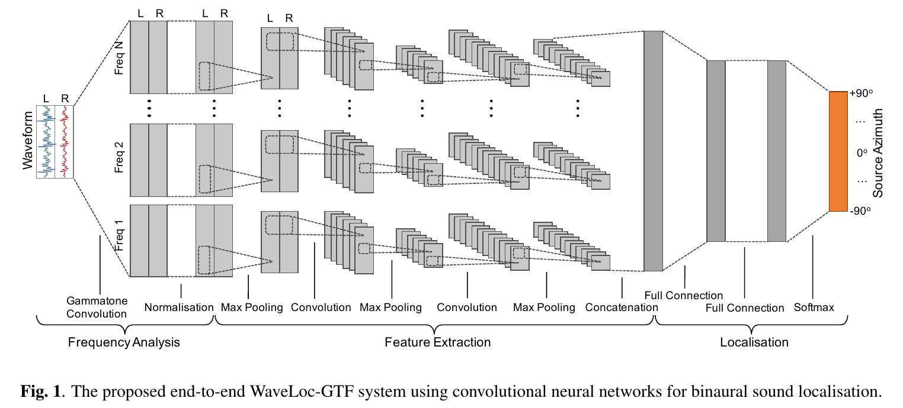
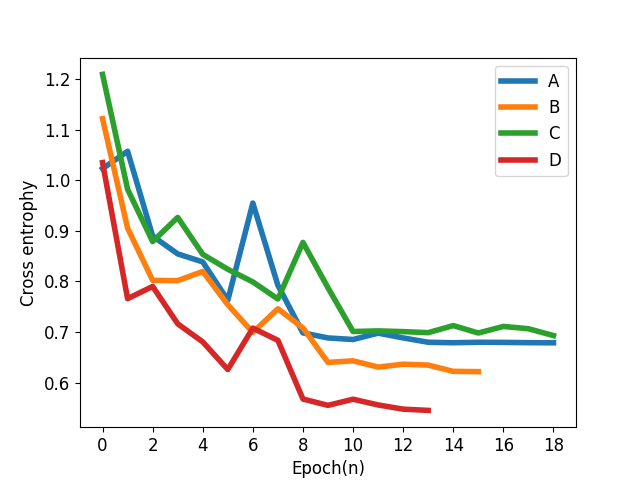

# End2End sound localization model

Reference:

  P. Vecchiotti, N. Ma, S. Squartini, and G. J. Brown, “END-TO-END BINAURAL SOUND LOCALISATION FROM THE RAW WAVEFORM,” in 2019 IEEE INTERNATIONAL CONFERENCE ON ACOUSTICS, SPEECH AND SIGNAL PROCESSING (ICASSP), 345 E 47TH ST, NEW YORK, NY 10017 USA, 2019, pp. 451–455.

**Only WaveLoc-GTF is implemented**

## Model

## Training
### Dataset
- BRIR

  Surrey binaural room impulse response (BRIR) database, including anechoic room and 4 reverberation room.

  <table style='text-align:center'>
  <tr>
    <td>Room</td> <td>A</td> <td>B</td> <td>C</td> <td>D</td>
  </tr>
  <tr>
    <td>RT_60(s)</td> <td>0.32</td> <td>0.47</td> <td>0.68</td> <td>0.89</td>
  </tr>
  <tr>
    <td>DDR(dB)</td> <td>6.09</td> <td>5.31</td> <td>8.82</td> <td>6.12</td>
  </tr>
  </table>

- Sound source

  TIMIT database

  Sentences per azimuth
  <table style='text-align:center'>
  <col width=15%>
  <col width=15%>
  <col width=15%>
    <tr>
      <td>Train</td> <td>Validate</td> <td>Evaluate</td>
    </tr>
    <tr>
      <td>24</td> <td>6</td> <td>15</td>
    </tr>
  </table>

## Multi-conditional training(MCT)

  For
  For each reverberant room, the rest 3 reverberant rooms and anechoic room are used for training

  Training curves
  

  
  

## Evaluation
Root mean square error(RMSE) is used as the metrics of performance. For each reverberant room, the evaluation was performed 3 times to get more stable results and the test dataset was regenerated each time.

Since binaural sound is directly fed to models without extra preprocess and there may be short pulses in speech, the localization result was reported based on chunks rather than frames. Each chunk consisted of 25 consecutive frames.

### My result vs. paper
<table style='text-align:center'>
<col width=30%>
<col width=15%>
<col width=15%>
<col width=15%>
<col width=15%>
  <tr>
    <th>Reverberant room</th> <th>A</th> <th>B</th> <th>C</th> <th>D</th>
   </tr>
   <tr>
   <th>My result</th> <td>1.5</td> <td>2.0</td> <td>1.4</td> <td>2.7</td>
   </tr>
   <tr>
   <th>Result in paper</th> <td>1.5</td> <td>3.0</td> <td>1.7</td> <td>3.5</td>
   </tr>
</table>

## Main dependencies
  - tensorflow-1.14
  - pysofa (can be installed by pip)
  - BasicTools (in my other [repository](https://github.com/bingo-todd/BasicTools))
