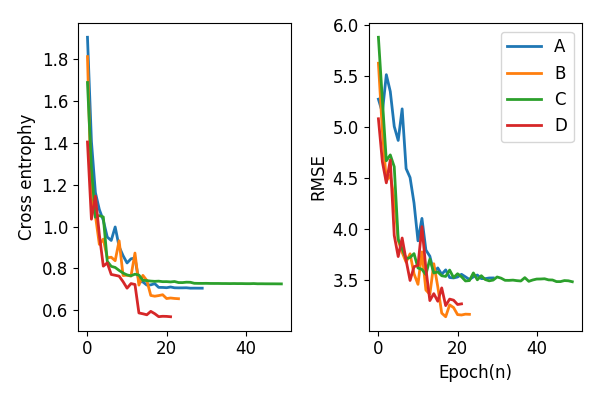
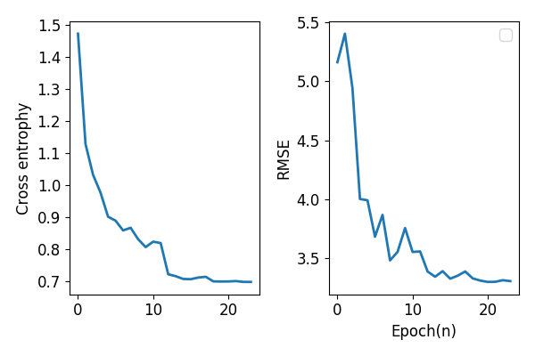
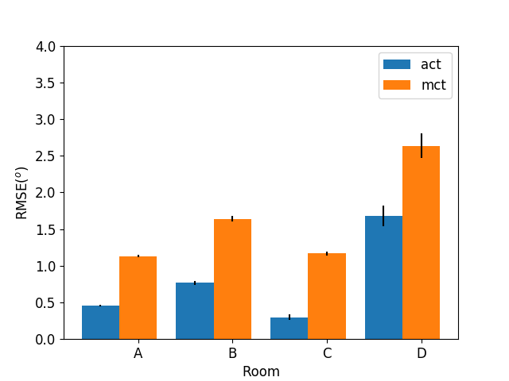

# End2End sound localization model

Reference:

  P. Vecchiotti, N. Ma, S. Squartini, and G. J. Brown, “END-TO-END BINAURAL SOUND LOCALISATION FROM THE RAW WAVEFORM,” in 2019 IEEE INTERNATIONAL CONFERENCE ON ACOUSTICS, SPEECH AND SIGNAL PROCESSING (ICASSP), 345 E 47TH ST, NEW YORK, NY 10017 USA, 2019, pp. 451–455.

**Only WaveLoc-GTF is implemented**

## Model

## Traning
### Dataset
- BRIR

  Surrey binaural room impulse response (BRIR) database, including anechoic room and 4 reverberation room.

  

- Sound source

  TIMIT database

  Sentences per azimuth
  <table style='text-align:center'>
  <col width=15%>
  <col width=15%>
  <col width=15%>
    <tr>
      <td>Train</td> <td>Validate</td> <td>Evaluate</td>
    </tr>
    <tr>
      <td>24</td> <td>6</td> <td>15</td>
    </tr>
  </table>

### Traning strategies

1. Multi-conditional training(MCT)

    Each time, 1 reverberant room is selected for evaluate, while the rest(anechoic room and 3 reverberant rooms) are used for model training

    Training curves
    

    
    

2. All-conditional traning(ACT)

  All rooms are used both for training and evaluation.
  

  
  

## Evaluation
Root mean square error(RMSE) is used as the measurement of performance.

For datasets synthesized in the same way, trained model performs a little different. RMSE averaged over three runs of evaluation is given.(**not in paper.**).

### My result vs. paper
<table style='text-align:center'>
<col width=30%>
<col width=15%>
<col width=15%>
<col width=15%>
<col width=15%>
  <tr>
    <th>Reverberant room</th> <th>A</th> <th>B</th> <th>C</th> <th>D</th>
   </tr>
   <tr>
   <th>My result</th> <td>1.13</td> <td>1.64</td> <td>1.17</td> <td>2.63</td>
   </tr>
   <tr>
   <th>Result in paper</th> <td>1.5</td> <td>3.0</td> <td>1.7</td> <td>3.5</td>
   </tr>
</table>

Comparasion between different training strategies

<table style='text-align:center'>
<col width=30%>
<col width=15%>
<col width=15%>
<col width=15%>
<col width=15%>
  <tr>
    <th>Reverberant room</th> <th>A</th> <th>B</th> <th>C</th> <th>D</th>
   </tr>
   <tr>
   <th>MCT</th> <td>1.13</td> <td>1.64</td> <td>1.17</td> <td>2.63</td>
   </tr>
   <tr>
   <th>ACT</th> <td>0.46</td> <td>0.77</td> <td>0.30</td> <td>1.68</td>
   </tr>
</table>

 

 
 

